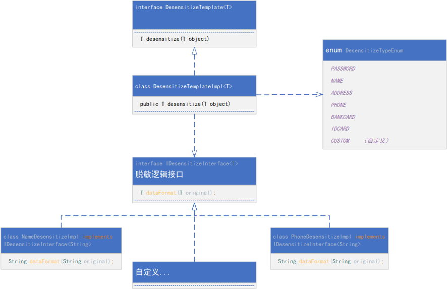
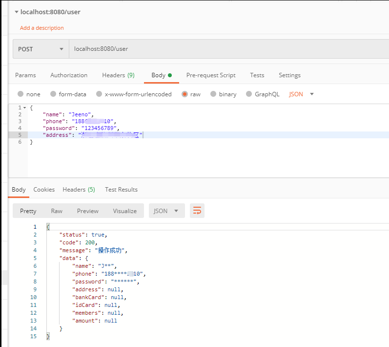
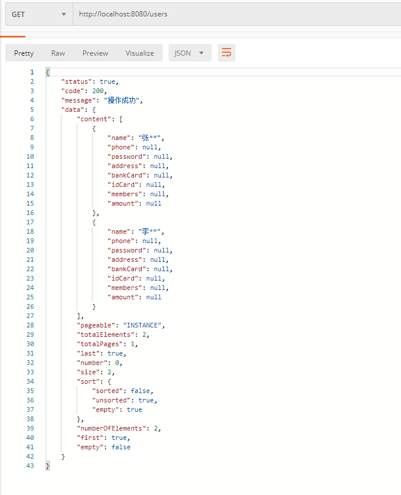

# 脱敏模块相关说明

## GIT地址

> https://github.com/JeenoD/desensitization-springboot-starter

## SpringBoot版本

```maven
<parent>
	<groupId>org.springframework.boot</groupId>
	<artifactId>spring-boot-starter-parent</artifactId>
	<version>2.3.4.RELEASE</version>
	<relativePath/>
</parent>  
```

## maven依赖

```maven
<dependency>    
    <groupId>com.jeeno</groupId>
    <artifactId>desensitization-spring-boot-starter</artifactId>
    <version>0.0.1</version>
</dependency>
```


## 主体架构图




# 1.相关注解

@DesensitizeType（作用在嵌套的对象字段）

@DesensitizeField（作用在类字段）

# 2.开放接口 DesensitizeTemplate<T>

```java
public interface DesensitizeTemplate<T> {
    /**
     * 对对象内容进行脱敏处理
     * @param object 返回对象
     * @return T 泛型对象
     * @throws IllegalAccessException 异常信息
     */
    T desensitize(T object) throws IllegalAccessException, ClassNotFoundException, NoSuchMethodException, InstantiationException, InvocationTargetException;
}
```

# 3.默认的脱敏格式枚举说明

DesensitizeTypeEnum类

| type枚举值 | 说明     | 默认格式                    | 原始数据               | 脱敏数据               |
| ---------- | -------- | --------------------------- | ---------------------- | ---------------------- |
| PASSWORD   | 密码     | `******`                    | `12345678`             | `******`               |
| NAME       | 姓名     | 留第一位，后面补*           | `张三四`               | `张**`                 |
| ADDRESS    | 地址     | 原样返回                    |                        |                        |
| PHONE      | 手机号   | 隐藏第4-8位                 | `12341234510`          | `123****4510`          |
| BANKCARD   | 银行卡号 | 留后4位，其它为*            | `123123 1231231238170` | `****** *********8170` |
| IDCARD     | 身份证号 | 留第一位和最后一位，其它为* | `301234123456781234`   | `3****************4`   |
| CUSTOM     | 自定义   |                             |                        |                        |

# 4.使用示例

## UserInfo.java

```java
package com.example.desensitizationdemo.pojo;

import com.example.desensitizationdemo.service.impl.MyDesensitizeImpl;
import com.jeeno.desensitization.annotation.DesensitizeField;
import com.jeeno.desensitization.annotation.DesensitizeType;
import com.jeeno.desensitization.enums.DesensitizeTypeEnum;
import lombok.AllArgsConstructor;
import lombok.Builder;
import lombok.Data;
import lombok.NoArgsConstructor;
import lombok.ToString;

import java.util.List;

/**
 * @author JEENO
 * @version 0.0.1
 * @date 2020/6/1 10:49
 */
@Data
@Builder
@ToString
@NoArgsConstructor
@AllArgsConstructor
public class UserInfo {

    @DesensitizeField(type = DesensitizeTypeEnum.NAME)
    private String name;

    @DesensitizeField(type = DesensitizeTypeEnum.PHONE)
    private String phone;

    @DesensitizeField(type = DesensitizeTypeEnum.PASSWORD)
    private String password;

    @DesensitizeField(type = DesensitizeTypeEnum.ADDRESS)
    private String address;

    @DesensitizeField(type = DesensitizeTypeEnum.BANKCARD)
    private String bankCard;

    @DesensitizeField(type = DesensitizeTypeEnum.IDCARD)
    private String idCard;

    /**
     * 嵌套对象，此时用@DesensitizeType注解，以达到扫描MemberInfo类字段
     */
    @DesensitizeType
    private List<MemberInfo> members;

    /**
     * 这里使用了自定义的数据脱敏实现，type必须为DesensitizeTypeEnum.CUSTOM
     * MyDesensitizeImpl 必须实现接口： IDesensitizeInterface<T>
     */
    @DesensitizeField(type = DesensitizeTypeEnum.CUSTOM, clazz = MyDesensitizeImpl.class)
    private Long amount;
}

```

## MemberInfo.java

```java
package com.example.desensitizationdemo.pojo;

import com.jeeno.desensitization.annotation.DesensitizeField;
import com.jeeno.desensitization.enums.DesensitizeTypeEnum;
import lombok.AllArgsConstructor;
import lombok.Builder;
import lombok.Data;
import lombok.NoArgsConstructor;
import lombok.ToString;

/**
 * @author JEENO
 * @version 0.0.1
 * @date 2020/6/2 10:57
 */
@Data
@Builder
@ToString
@NoArgsConstructor
@AllArgsConstructor
public class MemberInfo {

    @DesensitizeField(type = DesensitizeTypeEnum.NAME)
    private String name;

    @DesensitizeField(type = DesensitizeTypeEnum.PHONE)
    private String phone;
}

```

## ReturnDTO.java

```java
package com.example.desensitizationdemo.pojo;

import com.jeeno.desensitization.annotation.DesensitizeType;
import lombok.AllArgsConstructor;
import lombok.Builder;
import lombok.Data;
import lombok.NoArgsConstructor;
import lombok.ToString;

/**
 * @author JEENO
 * @version 0.0.1
 * @date 2020/6/1 10:18
 */
@Data
@Builder
@AllArgsConstructor
@NoArgsConstructor
@ToString
public class ReturnDTO<T> {

    private Boolean status;

    private Integer code;

    private String message;

    @DesensitizeType
    private T data;
}

```


## MyController.java

```java
package com.example.desensitizationdemo.controller;

import com.example.desensitizationdemo.pojo.ExtraInfo;
import com.example.desensitizationdemo.pojo.ReturnDTO;
import com.example.desensitizationdemo.pojo.UserInfo;
import lombok.extern.slf4j.Slf4j;
import org.springframework.data.domain.Page;
import org.springframework.data.domain.PageImpl;
import org.springframework.http.HttpStatus;
import org.springframework.web.bind.annotation.GetMapping;
import org.springframework.web.bind.annotation.PostMapping;
import org.springframework.web.bind.annotation.RequestBody;
import org.springframework.web.bind.annotation.RestController;

import java.util.ArrayList;
import java.util.List;


/**
 * 控制层对外接口
 * @author JEENO
 * @version 0.0.1
 * @date 2020/6/1 10:17
 */
@Slf4j
@RestController
public class MyController {

    @PostMapping("/user")
    public ReturnDTO<UserInfo> test(@RequestBody UserInfo userInfo) {
        return ReturnDTO.<UserInfo>builder()
                .status(true)
                .code(HttpStatus.OK.value())
                .message("操作成功")
                .data(userInfo)
                .build();
    }
    
   /**
    * 模拟JPA Page复杂类型
    */
    @GetMapping("/users")
    public ReturnDTO<Page<UserInfo>> getPages() {
        List<UserInfo> list = new ArrayList<>();
        list.add(UserInfo.builder().name("张三").build());
        list.add(UserInfo.builder().name("李四").build());
        PageImpl<UserInfo> pages = new PageImpl<>(list);
        return ReturnDTO.<Page<UserInfo>>builder()
                .status(true)
                .code(HttpStatus.OK.value())
                .message("操作成功")
                .data(pages)
                .build();
    }

}
```

自定义数据脱敏实现 MyDesensitizeImpl.java

```java
package com.example.desensitizationdemo.service.impl;

import com.jeeno.desensitization.service.IDesensitizeInterface;
import lombok.extern.slf4j.Slf4j;

/**
 * 自定义的数据脱敏格式
 * @author JEENO
 * @version 0.0.1
 * @date 2020/6/3 10:44
 */
@Slf4j
public class MyDesensitizeImpl implements IDesensitizeInterface<Long> {
    @Override
    public Long dataFormat(Long original) {
        return -1L;
    }
}


```


## Postman模拟前端请求



